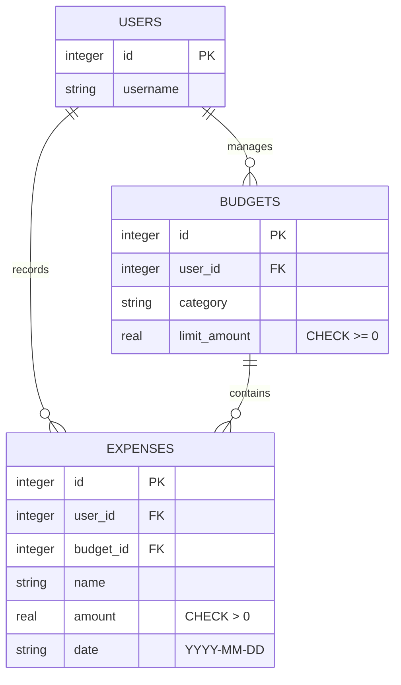
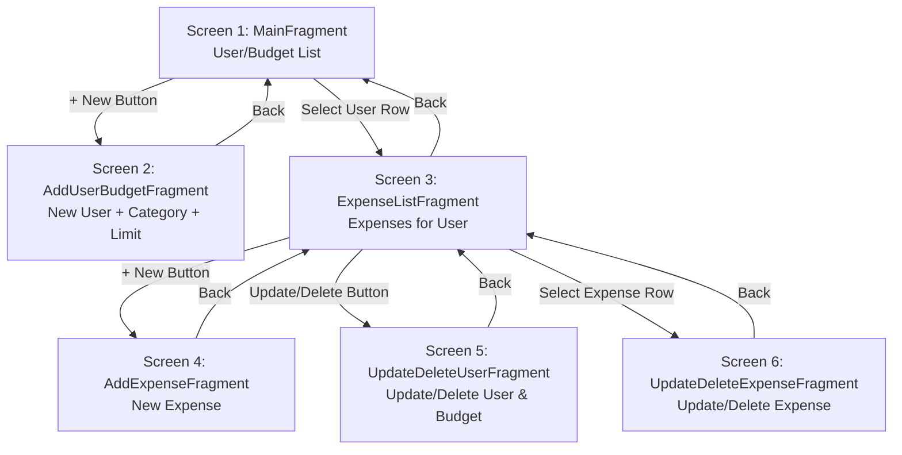

# Overview

## Sprint 3
In this sprint, I transitioned **EasiestBudget** from a command-line interface to a fully-featured, native Android application. I integrated a local Room Database to ensure data persistence, replacing the previous SQLite JDBC implementation with a more robust, Android-native ORM. This version represents a complete UI/UX overhaul using **Material Design 3**, mastering the Android lifecycle, Jetpack Navigation for seamless screen transitions, and ViewBinding for efficient UI interaction.

**EasiestBudget** is a personal finance app that helps users track their spending against custom budget limits. Users can create multiple profiles, each with a specific category and budget amount. Within each profile, they can record individual expenses, view their total spending, and manage their records with full CRUD (Create, Read, Update, Delete) capabilities. The app provides real-time feedback, such as warnings when an expense exceeds the allocated budget.

Key accomplishments in this sprint:
- **Reactive Data Layer:** Integrated a local Room Database with Kotlin Flows, ensuring that the UI updates instantly when financial records change.
- **Material 3 UI:** Implemented a modern, vibrant violet theme with standardized 16dp padding, 12dp rounded corners, and accessible 48dp touch targets.
- **Dynamic Sorting:** Built custom sorting logic for both the User Dashboard (by Name, Category, or Limit) and the Expense List (by Name, Date, or Amount).
- **Stability & Performance:** Resolved critical navigation race conditions and optimized main-thread usage to eliminate "Application Not Responding" (ANR) errors.
- **Accessibility & Localization:** Extracted all UI strings to `strings.xml` and added content descriptions for screen readers.

My purpose for creating this app was to build a practical, user-friendly tool that demonstrates a complete mobile development workflow—from UI design and navigation to local data persistence and business logic.

## Sprint 2
As a software engineer, I am developing **Easy Budget** to bridge the gap between high-level logic and persistent data management. My goal with this project is to master Kotlin’s object-oriented principles while gaining hands-on experience with relational database integration, specifically using the "Serverless" local-first architecture.

Easy Budget is a financial management tool currently operating as a Command Line Interface (CLI). It allows users to create, read, update, and delete (CRUD) financial records. Unlike simple in-memory trackers, this software interfaces directly with a SQLite database, ensuring that budget data persists across different sessions. The logic includes data validation, object-relational mapping using Kotlin Data Classes, and aggregate financial calculations.

The purpose of writing this software is to establish a robust backend foundation for a future native Android application. By handling the database logic in a standalone Kotlin environment first, I can ensure the core financial engine is stable, type-safe, and efficient before introducing the complexities of a mobile User Interface.

- [EasyBudget CLI with SQLite Database branch 2nd-spint-v3](https://github.com/hectapia/EasyBudget)

## Sprint 1
EasyBudget is a simple command-line expense tracker built in Kotlin. The goal of this project is to strengthen my skills as a software engineer by exploring the fundamentals of the Kotlin language while building a practical tool. Through this project, I aimed to understand how Kotlin handles variables, conditionals, loops, functions, classes, properties, and data classes, and how these concepts can be applied to real-world software.

The software allows users to record expenses, categorize them, and compare total spending against a budget limit. It demonstrates how Kotlin’s syntax and features can be used to implement clean, concise, and expressive code. My purpose in writing this software was to deepen my knowledge of Kotlin’s object-oriented programming capabilities and practice building a small but functional CLI application.

- [EasyBudget CLI without Database branch 1st-spint-v3](https://github.com/hectapia/EasyBudget)


## Diagrama relacional (Mermaid ER)



## Navigation between the layout screens. (Mermaid flowchart)


## Software Demo Videos

[Video Sprint 1](https://youtu.be/QyvKhQnDOjU) <br>
[Video Sprint 2](https://youtu.be/BBI-YFD-bNo) <br>
[Video Sprint 3](https://youtu.be/YOUR_VIDEO_LINK_HERE)

# Development Environment

- **Android Studio Ladybug** (or your specific version)
- **Android SDK** (API 34/35)
- **Kotlin Programming Language**
- **Libraries:**
    - **Jetpack Navigation:** For fragment-based navigation and Safe Args.
    - **Room Persistence Library:** For local SQLite database management.
    - **ViewBinding:** For safe interaction with UI components.
    - **Coroutines & Flow:** For asynchronous database operations and reactive UI updates.
    - **Material Components:** For modern UI design.

### How to run Sprint 1, branch 1st-sprint-v3
```
kotlinc EasyBudget.kt -include-runtime -d EasyBudget.jar
java -jar CLI-EasyBudget.jar
```

### How to run Sprint 2, branch 2nd-sprint-v2
```powershell
# use PowerShell
EasyBudget> kotlinc src/main.kt src/models/Expense.kt src/database/DatabaseManager.kt src/models/Budget.kt src/models/User.kt -cp "lib/sqlite-jdbc-3.51.2.0.jar" -include-runtime -d EasyBudget.jar

# use PowerShell or VS Code terminal
java --enable-native-access=ALL-UNNAMED -cp "EasyBudget.jar;lib/*" MainKt
```

### How to run Sprint 3
```bash
# 1. Clone the repository
git clone https://github.com/hectapia/EasiestBudget.git

# 2. Open the project in Android Studio

# 3. Build and Run the app
# You can use the "Run" button in Android Studio or use Gradle from the terminal:
./gradlew installDebug
```


# Useful Websites

- [Kotlin Official Documentation](https://kotlinlang.org/docs/home.html)  
- [Android Developers: Navigation Component](https://developer.android.com/guide/navigation)
- [Android Developers: Room Persistence Library](https://developer.android.com/training/data-storage/room)
- [Android Developers: ViewBinding](https://developer.android.com/topic/libraries/view-binding)
- [Stack Overflow](https://stackoverflow.com/questions/tagged/kotlin)  
- [GeeksforGeeks Kotlin Tutorials](https://www.geeksforgeeks.org/kotlin-programming-language/)

# Future Work

- **Data Visualization:** Implement interactive Pie and Bar charts to visualize spending categories and monthly trends.
- **Dynamic Color Support:** Expand the Material 3 implementation to support Android 12+ dynamic color (Monet) for a more personalized user experience.
- **Cloud Sync & Backup:** Integrate Firebase or Google Drive API to allow users to sync their budget data across multiple devices.
- **Smart Notifications:** Add proactive alerts when a user reaches 80% and 100% of their monthly budget limit.
- **Advanced Filtering:** Add a search bar and the ability to filter expenses by custom date ranges or price brackets.
